## tạo dự án

nest new + tên dự án

# base topic

## project structure

-   folder app

1. File-based Routing (Điều hướng dựa trên tệp):Thư mục app vẫn sử dụng phương pháp điều hướng dựa trên tệp tương tự như thư mục pages, nhưng với nhiều tính năng mở rộng. Mỗi tệp và thư mục trong app đều tương ứng với một route hoặc layout trong ứng dụng.
2. Layouts:Bạn có thể tạo layout riêng biệt cho các phần của ứng dụng bằng cách đặt các tệp layout.tsx trong thư mục con. Layouts cho phép bạn chia sẻ cấu trúc UI (như header, footer) giữa các trang mà không cần lặp lại mã.
   3.Nested Routing (Điều hướng lồng nhau):Thư mục app hỗ trợ routing lồng nhau, cho phép bạn tạo cấu trúc trang phức tạp với nhiều mức độ layout. Ví dụ, bạn có thể có một layout chính cho toàn bộ ứng dụng và các layout phụ cho các phần cụ thể của ứng dụng.
   4.Server and Client Components

-   Server Components: Mặc định, các component trong thư mục app là server components, có thể giúp cải thiện hiệu suất bằng cách giảm thiểu JavaScript được tải xuống client.
-   Client Components: Khi cần các tính năng chỉ có thể hoạt động trên client (như state management hoặc event handling), bạn có thể sử dụng "use client" để xác định component như vậy.
    5.Loading and Error Handling:Bạn có thể tạo các tệp loading.tsx và error.tsx để xử lý các trạng thái loading và lỗi một cách linh hoạt và rõ ràng.

6. API Routes:Bạn có thể định nghĩa các API routes trong thư mục app, tách biệt chúng khỏi các route của trang để giữ cho cấu trúc dự án rõ ràng hơn.
   example
   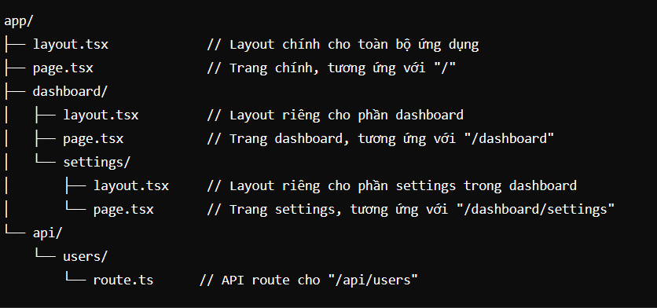

## React server component

-   trong nextjs có hại loại component
-   server component->được fetch và render phía server và sẽ không tông tại trong client-side bundle(file render ui phía client trong reactjs )
-   client componet-> render phí client
    **trong nextjs mậc định các component sẽ là server componet**
    **server componet ko sữ dụng được các hook của reactjs và không dùng để chỉ định cá thảo tác phía ui**

## routing

-   kể từ nextjs 13 cở chế router sẽ là app router

*   tất các các routes để nằm trong 1 thư mục app
*   file page.tsx sẽ chỉ định hiện ui
    -   tuyến đường cở bản trong nexjs
        app/profile/page.tsx -> url sex là https://domen.com/profile
        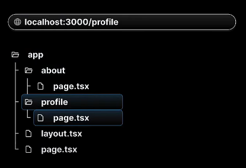
    -   gộp nhóm tuyến đường trong nextjs
        (app/(auth)/sign-in/page.tsx) -> https://domam.com/sign-in
        -> thư mục được đặt trong (...) sẽ ko hiển thị trên url
    -   nạp trông nhiều tuyến đường trong nextjs
        (app/blog/first/page.tsx)
        (app/blog/second/page.tsx)
        -> hai kiêu định nghĩa trên sẽ có hại trong khác nhhau đóc là
        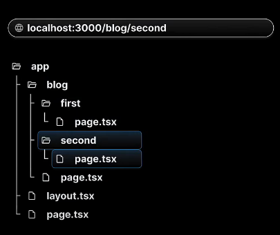
    -   dynamic routes
        (app/product/[productId]/page.tsx)
        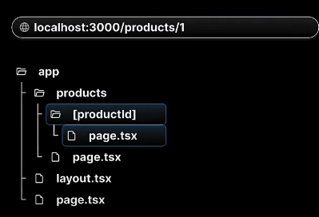
        -> biện productId sẽ lấy được trong pramas
        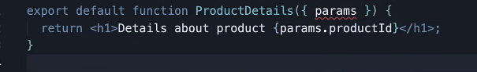
        -Nested Dynamic Routes
        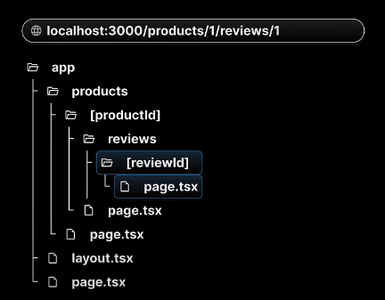

## Catch-all segmens

-> Catch-all Segments trong Next.js là một tính năng của hệ thống định tuyến (routing) cho phép bạn tạo các đường dẫn động (dynamic routes) có thể khớp với nhiều phân đoạn URL khác nhau
pages/blog/[...slug].js
các đường dẫn sau sẽ khớp với trang này:

/blog/hello-world
/blog/2023/08/08/hello-world
/blog/category/nextjs/tutorial

Trong tệp [...slug].js, bạn có thể truy cập các phần của URL thông qua params.slug, đây sẽ là một mảng chứa các phân đoạn URL.
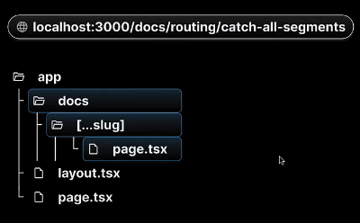

## custom Not Found Page

app/not-found.tsx -> định nghĩa trong not found toàn cục

app/blog/review/not-found.tsx -> định nghĩa trang not found cho trong blog với 1 điều kiện nhát định sử dụng hàm notfound() trong 'next/navigation' để diều hướng trang

## File Colocation

-> File Colocation là một phương pháp tổ chức mã nguồn trong một dự án, nơi mà các file có liên quan đến nhau được đặt cùng một chỗ, thường là trong cùng một thư mục.

## private folders

-> Trong Next.js, khái niệm "Private Folders" thường không phải là một tính năng hoặc khái niệm chính thức, nhưng có thể hiểu là các thư mục mà nội dung bên trong không được công khai, không được xuất bản trực tiếp như các trang thông qua URL, hoặc chỉ dùng nội bộ trong ứng dụng mà không hiển thị ra bên ngoài.

-   các thư mục năng trong folder public đề có thể truy cập từ bên ngoài thông qua url
-   các thư mục trong src ko thể truy cập từ bên ngoài
    **các folder năng ngoài thư mục app dù có file page.tsx thì cùng không thể truy cập được thông qua url**
    **các thư mục năm trong app và có file page.tsx sẽ được truy cập thông qua url**

## Layouts

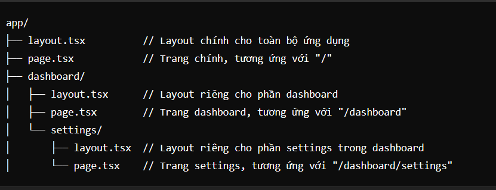

-   Root Layout: Tệp app/layout.tsx định nghĩa layout chính cho toàn bộ ứng dụng. Nội dung của ứng dụng sẽ được render trong phần <main>, trong khi các phần tử UI chung như header và footer được giữ nguyên trên tất cả các trang.
    +Nested Layouts: Tệp app/dashboard/layout.tsx định nghĩa một layout riêng cho phần dashboard, bao gồm một sidebar với các liên kết điều hướng. Tệp app/dashboard/settings/layout.tsx là một layout phụ cho các trang trong /dashboard/settings, cung cấp một tiêu đề riêng cho phần cài đặt.

note: sủ dụng layout cập cao và cập thấp: trong trường hợp có nhiều tràng có cùng 1 bô cục layout nhưng có 1 số trang ko cần để thì có thể sử dụng điệu kiện để tùy chọn có hiện thì layout đó hay không
example:

```tsx
// app/layout.tsx
import React from 'react';
import { useRouter } from 'next/router';
import './globals.css'; // CSS toàn cục cho ứng dụng

export default function RootLayout({
    children,
}: {
    children: React.ReactNode;
}) {
    const router = useRouter();
    const hideHeaderFooter = ['/login', '/register'].includes(router.pathname);

    return (
        <html>
            <body>
                {!hideHeaderFooter && (
                    <>
                        <header>
                            <h1>My Application</h1>
                        </header>
                        <footer>
                            <p>Footer Content</p>
                        </footer>
                    </>
                )}
                <main>{children}</main>
            </body>
        </html>
    );
}
```

## Routing Metadata

-   Trong Next.js 14, Routing Metadata cung cấp một cách để bổ sung thông tin mô tả về các route trong ứng dụng của bạn. Điều này giúp bạn dễ dàng quản lý các thuộc tính của route như tiêu đề trang, mô tả, và các thuộc tính khác mà bạn có thể muốn sử dụng cho SEO, cấu hình route, hoặc các yêu cầu khác.

*   Các Tính Năng Chính của Routing Metadata

    1.Tiêu Đề Trang (Page Titles):

*   Cho phép bạn thiết lập tiêu đề trang cụ thể cho mỗi route, giúp cải thiện SEO và trải nghiệm người dùng.

-   định nghịa metadata có trang con

*   tạo file head.tsx và return về metasata

```tsx
import React from 'react';

export default function SettingsHead() {
    return (
        <>
            <title>Settings - Dashboard</title>
            <meta
                name='description'
                content='Adjust your settings and preferences here.'
            />
            <meta property='og:title' content='Settings - Dashboard' />
            <meta
                property='og:description'
                content='Adjust your settings and preferences here.'
            />
        </>
    );
}
```

## title Metadata

-   xác định tên của trang

```tsx
import { Metadata } from 'next';
export const metadata: Metadata = {
    title: {
        absolute: '',
        //.....
    },
};
```

## Link Component Navigation

#### Các Tính Năng Chính của Link Component

1. Điều Hướng Không Tải Lại (Client-side Navigation):
   2.Prefetching:Link component có thể tự động tải trước dữ liệu và mã nguồn của trang được liên kết, giúp trang đích tải nhanh hơn khi người dùng nhấp vào liên kết.

```tsx
<Link href='/about' prefetch={false}>
    <a>Go to About Page</a>
</Link>
```

3. Dynamic Routing:Link component hỗ trợ dynamic routing, cho phép bạn sử dụng các đường dẫn động dựa trên URL params.

```tsx
import Link from 'next/link';

export default function UsersPage() {
    const userId = 1; // Ví dụ về ID người dùng
    return (
        <div>
            <h1>Users List</h1>
            <Link href={`/users/${userId}`}>
                <a>Go to User {userId}'s Profile</a>
            </Link>
        </div>
    );
}
```

4.Gắn Cờ Chức Năng:ó thể điều chỉnh hành vi của Link thông qua các props như prefetch, replace, scroll, và shallow.

## Navigating Programmatically

-   Trong Next.js 14, useRouter là một hook quan trọng cung cấp quyền truy cập vào đối tượng router của Next.js. Với useRouter, bạn có thể lấy thông tin về route hiện tại, thực hiện điều hướng chương trình, và quản lý lịch sử duyệt web. Đây là một công cụ mạnh mẽ cho việc xây dựng các ứng dụng phức tạp với điều hướng động.

#### Cách Sử Dụng useRouter

1.  Lấy Thông Tin Route Hiện Tại
    useRouter cung cấp thông tin về đường dẫn, query params, và các phần tử khác của route hiện tại.

```tsx
import { useRouter } from 'next/router';

export default function MyComponent() {
    const router = useRouter();
    const { pathname, query, asPath } = router;

    return (
        <div>
            <p>Pathname: {pathname}</p>
            <p>Query: {JSON.stringify(query)}</p>
            <p>AsPath: {asPath}</p>
        </div>
    );
}
```

-   pathname: Trả về đường dẫn hiện tại, ví dụ: /about.
-   query: Trả về các query parameters trong URL dưới dạng object, ví dụ: { id: '123' } nếu URL là /page?id=123.
-   asPath: Trả về toàn bộ đường dẫn bao gồm cả phần query string, ví dụ: /page?id=123.

2.  Điều Hướng Chương Trình (Programmatic Navigation)

```tsx
import { useRouter } from 'next/router';

export default function NavigateComponent() {
    const router = useRouter();

    const goToAbout = () => {
        router.push('/about');
    };

    const replaceToHome = () => {
        router.replace('/');
    };

    return (
        <div>
            <button onClick={goToAbout}>Go to About Page</button>
            <button onClick={replaceToHome}>Replace with Home Page</button>
        </div>
    );
}
```

-   router.push: Điều hướng đến một route mới và thêm nó vào lịch sử duyệt web.
-   router.replace: Điều hướng đến một route mới nhưng thay thế route hiện tại trong lịch sử duyệt web.
-   router.back: Quay lại route trước đó trong lịch sử duyệt web.

3.  Xử Lý Các Sự Kiện Route

-   useRouter cũng cho phép bạn theo dõi các sự kiện liên quan đến routing.

```tsx
import { useRouter } from 'next/router';
import { useEffect } from 'react';

export default function RouteEventComponent() {
    const router = useRouter();

    useEffect(() => {
        const handleRouteChange = (url: string) => {
            console.log('App is changing to: ', url);
        };

        router.events.on('routeChangeStart', handleRouteChange);

        return () => {
            router.events.off('routeChangeStart', handleRouteChange);
        };
    }, [router]);

    return <div>Watch the console for route changes</div>;
}
```

## Templates

-   Trong Next.js 14, Templates là một tính năng mới được thiết kế để giúp bạn tái sử dụng các layout và cấu trúc trang trong các phần khác nhau của ứng dụng. Templates cho phép bạn định nghĩa các phần giao diện mà nhiều routes có thể chia sẻ, nhưng mỗi route vẫn có thể có nội dung động riêng biệt.

#### Cách Templates Hoạt Động

-   Templates hoạt động tương tự như Layouts nhưng linh hoạt hơn. Trong khi Layouts được áp dụng đồng nhất cho một nhóm trang, Templates có thể được sử dụng để tạo ra những cấu trúc trang chung mà vẫn cho phép sự khác biệt rõ ràng giữa các trang cụ thể.

Ví dụ: Sử Dụng Templates

-   Giả sử bạn có một ứng dụng với nhiều trang sản phẩm, và bạn muốn tất cả các trang sản phẩm này sử dụng cùng một bố cục chung nhưng có phần nội dung riêng.

1.  Tạo Template Component
    // app/templates/ProductTemplate.tsx

```tsx
import React from 'react';

export default function ProductTemplate({
    children,
}: {
    children: React.ReactNode;
}) {
    return (
        <div>
            <header>
                <h1>Product Template</h1>
            </header>
            <main>{children}</main>
            <footer>
                <p>Product Footer</p>
            </footer>
        </div>
    );
}
```

2.  Sử Dụng Template Trong Các Trang Cụ Thể

-   Sau đó, bạn có thể sử dụng ProductTemplate trong các trang sản phẩm của bạn:
    // app/products/[id]/page.tsx

    ```tsx
    import ProductTemplate from '../../templates/ProductTemplate';
    export default function ProductPage({
        params,
    }: {
        params: { id: string };
    }) {
        return (
            <ProductTemplate>
                <h2>Product ID: {params.id}</h2>
                <p>This is the product description for product {params.id}.</p>
            </ProductTemplate>
        );
    }
    ```

```

```

#### Khi Nào Nên Sử Dụng Templates

     + Tái Sử Dụng Bố Cục: Khi bạn có nhiều trang hoặc routes cần chia sẻ cùng một bố cục nhưng có nội dung khác nhau.

-   Tạo Cấu Trúc Phức Tạp: Khi bạn muốn xây dựng các trang có cấu trúc phức tạp, nơi các phần của trang được chia sẻ nhưng vẫn có thể tùy biến cho mỗi trang cụ thể.

#### Khác Biệt Giữa Layouts và Templates

-   Layouts: Thường được sử dụng để áp dụng một bố cục cố định cho một nhóm trang hoặc toàn bộ ứng dụng.
-   Templates: Linh hoạt hơn và cho phép bạn định nghĩa các khối bố cục có thể tái sử dụng nhưng vẫn cho phép các trang khác nhau tùy chỉnh nội dung cụ thể của chúng.

## loading UI

-Trong Next.js 14, Loading UI là một tính năng hữu ích để cải thiện trải nghiệm người dùng khi các trang hoặc dữ liệu đang được tải. Bằng cách sử dụng các tệp loading.tsx hoặc loading.jsx, bạn có thể định nghĩa giao diện tải (loading state) cho mỗi route cụ thể trong ứng dụng của mình.

Cách Sử Dụng Loading UI

-Bạn có thể tạo một tệp loading.tsx trong bất kỳ thư mục route nào trong app directory để hiển thị giao diện tải khi route đó đang chờ dữ liệu hoặc đang tải nội dung.

## Error Handling

-   Next.js 14 giới thiệu tệp error.tsx để xử lý lỗi cụ thể cho từng route. Khi có lỗi xảy ra trong route, Next.js sẽ hiển thị UI được định nghĩa trong tệp này.

```tsx
// app/users/[id]/error.tsx
export default function UserError({
    error,
    reset,
}: {
    error: Error;
    reset: () => void;
}) {
    return (
        <div>
            <h2>Something went wrong!</h2>
            <p>{error.message}</p>
            <button onClick={() => reset()}>Try Again</button>
        </div>
    );
}
```

1.  Error Boundaries

```tsx
import React, { Component, ReactNode } from 'react';

class ErrorBoundary extends Component<
    { children: ReactNode },
    { hasError: boolean }
> {
    constructor(props) {
        super(props);
        this.state = { hasError: false };
    }

    static getDerivedStateFromError() {
        return { hasError: true };
    }

    componentDidCatch(error, errorInfo) {
        console.error('Error caught by Error Boundary:', error, errorInfo);
    }

    render() {
        if (this.state.hasError) {
            return <h1>Something went wrong.</h1>;
        }

        return this.props.children;
    }
}

export default ErrorBoundary;
```

```tsx
import ErrorBoundary from './ErrorBoundary';
import SomeComponent from './SomeComponent';

export default function App() {
    return (
        <ErrorBoundary>
            <SomeComponent />
        </ErrorBoundary>
    );
}
```

## Parallel Routes

-   Trong Next.js 14, Parallel Routes là một tính năng mới giúp bạn có thể render đồng thời nhiều routes trong ứng dụng, tạo ra các layout phức tạp hơn và tăng khả năng tùy biến cho các thành phần trong giao diện người dùng.
-   Parallel Routes cho phép bạn định nghĩa nhiều routes độc lập và render chúng cùng lúc trong cùng một layout. Điều này rất hữu ích trong các tình huống bạn muốn hiển thị nhiều thành phần khác nhau trên trang mà không phụ thuộc vào thứ tự load của các routes khác nhau.

#### Cách Hoạt Động của Parallel Routes

-   Với Parallel Routes, bạn có thể tạo các cấu trúc layout phức tạp bằng cách chỉ định nhiều route trong một bố cục, và chúng sẽ được render song song. Các routes này được định nghĩa trong thư mục app với cấu trúc như sau:

*   @routeA: Chỉ định một route song song với route khác, thường được đặt trong layout component.
*   @routeB: Một route song song khác, sẽ được render đồng thời với @routeA.

Ví dụ về Parallel Routes

-   Giả sử bạn có một trang dashboard và muốn chia thành hai phần: một phần là thông tin tổng quan và phần còn lại là các biểu đồ thống kê. Bạn có thể sử dụng Parallel Routes để đạt được điều này.
    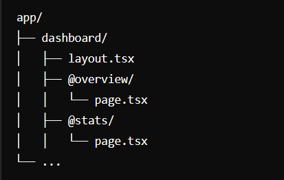
    -Định Nghĩa Layout với Parallel Routes

```tsx
// app/dashboard/layout.tsx

export default function DashboardLayout({
    children,
}: {
    children: React.ReactNode;
}) {
    return (
        <div style={{ display: 'flex' }}>
            <div style={{ flex: 1 }}>{children}</div>
        </div>
    );
}
```

-   Tạo Nội Dung Cho Các Routes Song Song

```tsx
// app/dashboard/@overview/page.tsx

export default function OverviewPage() {
    return (
        <div>
            <h2>Overview</h2>
            <p>This is the overview section.</p>
        </div>
    );
}

// app/dashboard/@stats/page.tsx

export default function StatsPage() {
    return (
        <div>
            <h2>Statistics</h2>
            <p>This is the stats section.</p>
        </div>
    );
}
```

-> Khi người dùng truy cập vào /dashboard, Next.js sẽ render đồng thời cả hai route @overview và @stats trong cùng một layout. Điều này giúp tối ưu hóa thời gian tải và cung cấp trải nghiệm người dùng liền mạch.

## Unmatched Routes

Unmatched Routes trong Next.js 14 giúp bạn kiểm soát các tình huống mà người dùng truy cập vào một URL không tồn tại trong ứng dụng của bạn. Bằng cách sử dụng custom 404 pages, dynamic routing, và middleware, bạn có thể đảm bảo rằng người dùng có được trải nghiệm tốt ngay cả khi họ gặp phải các URL không hợp lệ. Điều này giúp cải thiện tính thân thiện và độ tin cậy của ứng dụng web của bạn.

## Intercepting Routes

-   Trong Next.js 14, Intercepting Routes (chặn và xử lý các route) là một tính năng mạnh mẽ cho phép bạn can thiệp vào quá trình xử lý các yêu cầu và điều chỉnh hành vi của các route dựa trên các điều kiện cụ thể. Điều này rất hữu ích khi bạn cần thực hiện các hành động như kiểm tra quyền truy cập, chuyển hướng, hoặc thay đổi dữ liệu trước khi một route được xử lý hoàn toàn.

##### Cách Sử Dụng Intercepting Routes

1.  middleware

-   Middleware là cách chính để intercept và xử lý các route trong Next.js. Middleware cho phép bạn can thiệp vào yêu cầu trước khi chúng đến route cụ thể, giúp bạn thực hiện các hành động như xác thực, chuyển hướng, và xử lý lỗi.
    -Tạo một tệp middleware.ts hoặc middleware.js trong thư mục gốc của dự án hoặc trong thư mục app:

```tsx
import { NextResponse } from 'next/server';
import type { NextRequest } from 'next/server';
export function middleware(req: NextRequest) {
    const url = req.nextUrl.clone();

    // Ví dụ: Chuyển hướng tất cả các yêu cầu đến trang login nếu người dùng chưa đăng nhập
    if (!req.cookies.get('auth-token')) {
        if (url.pathname !== '/login') {
            url.pathname = '/login';
            return NextResponse.redirect(url);
        }
    }

    return NextResponse.next();
}
```

-   NextRequest: Đại diện cho yêu cầu HTTP.
-   NextResponse: Được sử dụng để tạo phản hồi hoặc chuyển hướng.
-   req.cookies.get('auth-token'): Kiểm tra cookie để xác thực người dùng.

2.  loading.tsx và erro.tsx file
3.  custom routing logic

## Handling GET Request

Trong Next.js 14, việc xử lý các yêu cầu HTTP, bao gồm cả GET request, đã trở nên đơn giản và mạnh mẽ hơn nhờ vào việc sử dụng thư mục app và các tính năng mới như Route Handlers.

#### Cách Xử Lý GET Request trong Next.js 14

-Bạn có thể xử lý GET request bằng cách tạo ra các Route Handlers trong thư mục app. Route Handlers cho phép bạn xử lý các yêu cầu HTTP trực tiếp trong các tệp JavaScript hoặc TypeScript, thay vì phải sử dụng API routes truyền thống trong thư mục pages/api.

1. Tạo Route Handler cho GET Request
   -Bạn có thể tạo một route handler bằng cách tạo một tệp route.ts hoặc route.js trong thư mục app. Để xử lý một GET request, bạn sẽ export một hàm GET từ tệp này.
   Ví dụ:
   Giả sử bạn muốn xử lý GET request cho một endpoint /api/data để trả về một danh sách dữ liệu:
   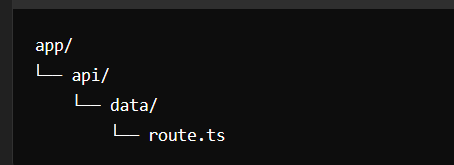

```tsx
import { NextResponse } from 'next/server';

export async function GET() {
    // Ví dụ: Trả về một danh sách JSON từ một API hoặc database
    const data = [
        { id: 1, name: 'Item 1' },
        { id: 2, name: 'Item 2' },
        { id: 3, name: 'Item 3' },
    ];

    return NextResponse.json(data);
}
```

#### Cách Hoạt Động:

-   GET function: Hàm này sẽ được gọi khi có một GET request đến endpoint /api/data.
-   NextResponse.json(data): Sử dụng để trả về phản hồi JSON chứa dữ liệu.

2. Xử Lý GET Request với Dynamic Routes
   -Nếu bạn muốn xử lý GET request cho một route động, bạn có thể tạo các dynamic route bằng cách sử dụng cú pháp [param].
   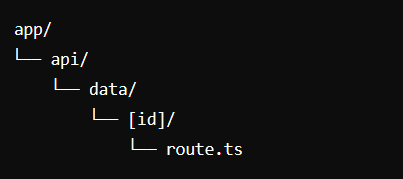
3. Middleware và Error Handling
   -Bạn có thể kết hợp route handlers với middleware để xử lý các yêu cầu phức tạp hơn, như kiểm tra xác thực hoặc ghi log, trước khi yêu cầu được gửi đến route handler.

```tsx
import { NextResponse } from 'next/server';
import type { NextRequest } from 'next/server';

export function middleware(req: NextRequest) {
    const token = req.cookies.get('auth-token');

    if (!token) {
        return NextResponse.redirect(new URL('/login', req.url));
    }

    return NextResponse.next();
}
```

**Note:các phương thức post, patch, delete đều sử lý tương tự**

## Redirects in Route Handlers

-Trong Next.js 14, Redirects in Route Handlers cho phép bạn chuyển hướng người dùng từ một route này sang một route khác trong quá trình xử lý các yêu cầu HTTP. Điều này có thể được thực hiện một cách dễ dàng thông qua các Route Handlers bằng cách sử dụng NextResponse.redirect.

#### Cách Thực Hiện Redirect trong Route Handlers

-   Khi xử lý các yêu cầu HTTP như GET, POST, PATCH, DELETE, bạn có thể sử dụng NextResponse.redirect để thực hiện việc chuyển hướng người dùng đến một URL khác.

1. Sử dụng NextResponse.redirect
   NextResponse.redirect là một phương thức trong Next.js cho phép bạn tạo ra một phản hồi HTTP 3xx để chuyển hướng người dùng.
   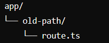

```tsx
// app/old-path/route.ts
import { NextResponse } from 'next/server';

export async function GET() {
    return NextResponse.redirect('/new-path');
}
```

-> NextResponse.redirect('/new-path'): Chuyển hướng yêu cầu từ /old-path đến /new-path.
-> Status Code 307: Mặc định, Next.js sử dụng mã trạng thái 307 cho việc chuyển hướng tạm thời. Nếu muốn chuyển hướng vĩnh viễn, bạn có thể sử dụng mã 308. 2. Redirect với Query Parameters 3. Redirect với Dynamic Routes 4. Redirect với Custom Status Code

## Headers in Route Handlers

-> tượng tự trong express
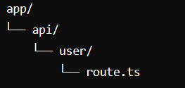

```tsx
// app/api/user/route.ts
import { NextResponse } from 'next/server';

export async function GET(req: Request) {
    const authHeader = req.headers.get('Authorization');

    if (!authHeader || authHeader !== 'Bearer my-secret-token') {
        return NextResponse.json({ error: 'Unauthorized' }, { status: 401 });
    }

    return NextResponse.json({ message: 'Authorized' });
}
```

## Cookies in Route Handlers

-> tương tự trong express

```tsx
// app/api/get-cookie/route.ts
import { NextResponse } from 'next/server';

export async function GET(req: Request) {
    // Lấy cookie có tên là 'token'
    const token = req.cookies.get('token');

    if (!token) {
        return NextResponse.json({ error: 'Token not found' }, { status: 404 });
    }

    return NextResponse.json({ token });
}
```

## Caching in Route Handlers

-   Caching trong Route Handlers của Next.js 14 mang lại rất nhiều lợi ích trong việc tối ưu hóa hiệu suất ứng dụng. Bằng cách tận dụng Cache-Control headers, ISR, và các cơ chế caching server-side, bạn có thể giảm tải máy chủ, tăng tốc độ phản hồi, và cải thiện trải nghiệm người dùng một cách đáng kể. Caching là một công cụ quan trọng giúp ứng dụng của bạn không chỉ nhanh hơn mà còn hiệu quả hơn trong việc quản lý tài nguyên.

## Middleware

-   Middleware trong Next.js 14 là một tính năng mạnh mẽ cho phép bạn chạy code trước khi yêu cầu được xử lý bởi các route handlers, page components, hoặc API routes. Với Middleware, bạn có thể thực hiện các tác vụ như xác thực người dùng, kiểm tra quyền truy cập, chuyển hướng (redirects), thêm headers, và nhiều thao tác khác trước khi cho phép yêu cầu tiếp tục.

#### Cách Hoạt Động của Middleware

-   Middleware trong Next.js được đặt trong thư mục gốc của dự án (root) và áp dụng cho tất cả các routes (đường dẫn) hoặc một phần của ứng dụng dựa trên cấu hình của bạn.

1. Tạo Middleware
   Middleware trong Next.js 14 được định nghĩa bằng cách tạo tệp middleware.ts hoặc middleware.js trong thư mục gốc của dự án.
   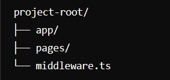

```tsx
import { NextResponse } from 'next/server';
import type { NextRequest } from 'next/server';

export function middleware(req: NextRequest) {
    const { pathname } = req.nextUrl;

    // Xác thực người dùng
    if (pathname.startsWith('/dashboard')) {
        const token = req.cookies.get('token');
        if (!token) {
            // Chuyển hướng đến trang đăng nhập nếu không có token
            return NextResponse.redirect(new URL('/login', req.url));
        }
    }

    // Tiếp tục yêu cầu nếu mọi thứ hợp lệ
    return NextResponse.next();
}
```

-   req.nextUrl: Truy cập URL của yêu cầu hiện tại.
-   pathname.startsWith('/dashboard'): Kiểm tra xem yêu cầu có đang truy cập vào một đường dẫn cụ thể không.
-   req.cookies.get('token'): Lấy cookie token từ yêu cầu.
-   NextResponse.redirect(): Chuyển hướng yêu cầu nếu không có token xác thực.
-   NextResponse.next(): Cho phép yêu cầu tiếp tục đến route handler hoặc page component tương ứng.

2. Cấu Hình Middleware

-   Bạn có thể cấu hình Middleware để chỉ áp dụng cho một số routes hoặc path cụ thể bằng cách sử dụng matcher.

```tsx
export const config = {
    matcher: ['/dashboard/:path*', '/settings/:path*'],
};
```

-   matcher: Định nghĩa các đường dẫn mà Middleware sẽ áp dụng. Bạn có thể sử dụng các ký tự đại diện như :path\* để khớp với mọi thứ sau một đường dẫn cụ thể.

3. Sử Dụng Các Header và Cookies

```tsx
export function middleware(req: NextRequest) {
    const response = NextResponse.next();
    response.headers.set('X-Custom-Header', 'MyValue');
    return response;
}
```

Thiết Lập Cookie:

```tsx
export function middleware(req: NextRequest) {
    const response = NextResponse.next();
    response.cookies.set('user', 'John Doe', { httpOnly: true });
    return response;
}
```

4. Chuyển Hướng và Viết Lại (Redirects & Rewrites)

-   Middleware có thể được sử dụng để chuyển hướng hoặc viết lại các yêu cầu dựa trên điều kiện cụ thể.

```tsx
export function middleware(req: NextRequest) {
    const token = req.cookies.get('token');
    if (!token) {
        return NextResponse.redirect(new URL('/login', req.url));
    }

    return NextResponse.next();
}
```

#### Rendering

-Rendering trong Next.js 14 có nhiều phương thức khác nhau để tạo ra và hiển thị nội dung cho người dùng. Hiểu rõ các phương thức này sẽ giúp bạn tối ưu hóa hiệu suất ứng dụng và cải thiện trải nghiệm người dùng. Dưới đây là các phương thức rendering chính trong Next.js 14:

1. Static Site Generation (SSG)

-   tatic Site Generation (SSG) là phương thức rendering mà nội dung được tạo ra tĩnh (static) tại thời điểm build (lúc triển khai). Các trang tĩnh này được lưu trữ trên CDN và phục vụ nhanh chóng cho người dùng.

```tsx
// app/blog/page.tsx
export async function generateStaticParams() {
    // Fetch dữ liệu từ API hoặc cơ sở dữ liệu
    const posts = await getPosts();

    // Trả về danh sách params để tạo các trang tĩnh
    return posts.map((post) => ({ slug: post.slug }));
}

export default function BlogPost({ params }) {
    // Fetch dữ liệu tĩnh cho một post cụ thể
    const post = getPostBySlug(params.slug);

    return <div>{post.title}</div>;
}
```

Khi nào sử dụng:

-   Khi dữ liệu không thay đổi thường xuyên.
-   Khi bạn muốn trang tải nhanh chóng với nội dung được lưu trữ trên CDN.

2. Server-Side Rendering (SSR)

-   Server-Side Rendering (SSR) là phương thức rendering mà nội dung được tạo ra động (dynamic) trên server mỗi khi có yêu cầu từ người dùng. Sau đó, HTML được gửi về client để hiển thị ngay lập tức.

```tsx
// app/dashboard/page.tsx
export async function getServerSideProps() {
    // Fetch dữ liệu tại server mỗi khi có yêu cầu
    const data = await fetchDataFromAPI();

    return {
        props: {
            data,
        },
    };
}

export default function Dashboard({ data }) {
    return <div>{data.title}</div>;
}
```

Khi nào sử dụng:

-   Khi dữ liệu thay đổi thường xuyên và cần được cập nhật cho mỗi yêu cầu.
-   Khi bạn cần dữ liệu động từ server mỗi khi người dùng tải trang.

3. Client-Side Rendering (CSR)

-   Client-Side Rendering (CSR) là phương thức rendering mà nội dung được tải và hiển thị trên client (trình duyệt) bằng JavaScript. Ban đầu, một HTML trống hoặc skeleton được tải, sau đó JavaScript sẽ lấy dữ liệu và hiển thị nội dung.

```tsx
// app/products/page.tsx
import { useEffect, useState } from 'react';

export default function Products() {
    const [products, setProducts] = useState([]);

    useEffect(() => {
        async function fetchProducts() {
            const response = await fetch('/api/products');
            const data = await response.json();
            setProducts(data);
        }

        fetchProducts();
    }, []);

    return (
        <div>
            {products.map((product) => (
                <div key={product.id}>{product.name}</div>
            ))}
        </div>
    );
}
```

Khi nào sử dụng:

-   Khi bạn cần tương tác nhiều với dữ liệu động trên client.
-   Khi hiệu suất của server không phải là vấn đề quan trọng.

4.  Incremental Static Regeneration (ISR)

-   ncremental Static Regeneration (ISR) kết hợp giữa SSG và SSR, cho phép tạo các trang tĩnh nhưng vẫn có thể cập nhật chúng định kỳ mà không cần phải tái triển khai toàn bộ ứng dụng.

```tsx
// app/blog/page.tsx
export async function generateStaticParams() {
    const posts = await getPosts();
    return posts.map((post) => ({ slug: post.slug }));
}

export default function BlogPost({ params }) {
    const post = getPostBySlug(params.slug);
    return <div>{post.title}</div>;
}

// Cấu hình ISR
export const revalidate = 60; // Trang sẽ được tái tạo sau mỗi 60 giây
```

Khi nào sử dụng:

-   Khi bạn muốn trang tĩnh nhưng cần cập nhật dữ liệu theo định kỳ.

5.  Streaming and Suspense

-   Streaming and Suspense là tính năng mới trong React và được hỗ trợ bởi Next.js 14, cho phép server gửi từng phần của trang tới client ngay khi nó sẵn sàng. Điều này cải thiện thời gian phản hồi và trải nghiệm người dùng bằng cách hiển thị nội dung nhanh hơn.

```tsx
// app/profile/page.tsx
import { Suspense } from 'react';

function ProfileInfo() {
    // Component tải dữ liệu người dùng
    return <div>User Info</div>;
}

export default function ProfilePage() {
    return (
        <div>
            <Suspense fallback={<div>Loading profile...</div>}>
                <ProfileInfo />
            </Suspense>
        </div>
    );
}
```

Khi nào sử dụng:

-   Khi bạn muốn cải thiện tốc độ phản hồi bằng cách hiển thị nội dung từng phần.
-   Khi bạn có những phần dữ liệu tải lâu hơn nhưng không muốn chờ toàn bộ trang được tải trước khi hiển thị.

6.  RSC (React Server Components)

-   React Server Components (RSC) là một phương pháp mới để viết các components chỉ được render trên server. Điều này giúp giảm tải công việc của client, đồng thời vẫn giữ cho ứng dụng nhanh chóng và hiệu quả.

```tsx
// app/server-component.tsx
export default function ServerComponent() {
    return <div>Data rendered on server</div>;
}
```

#### RSC Rendering Lifecycle
